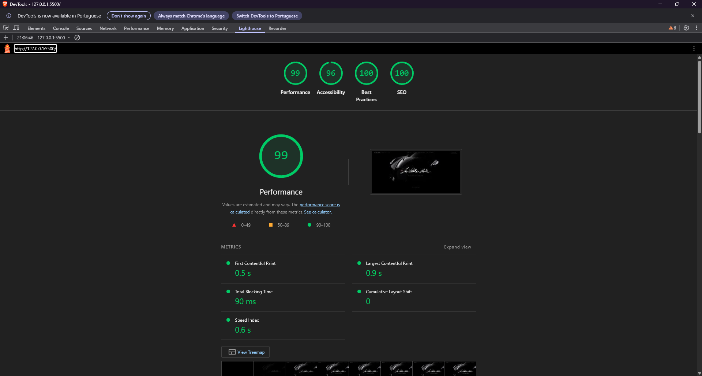
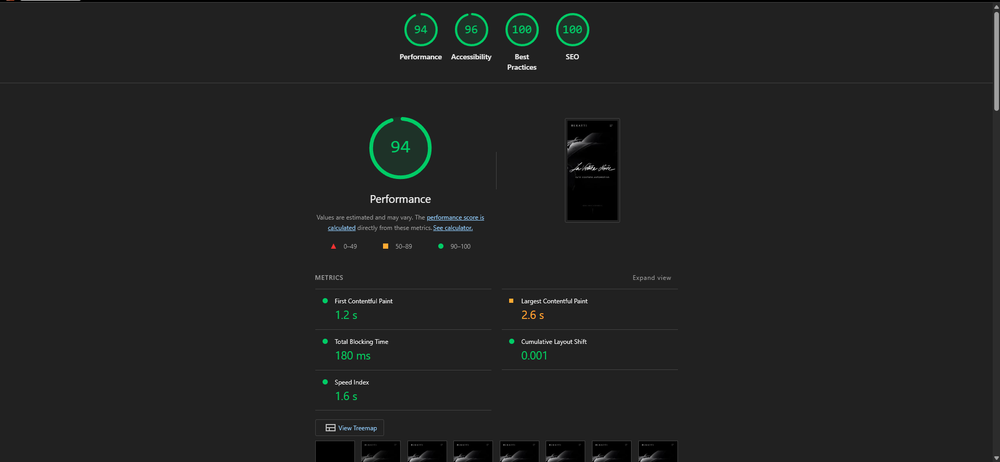

# 🏎️ Bugatti La Voiture Noire — Cinematic Landing

Landing page conceitual do hipercarro **Bugatti La Voiture Noire**, construída com **HTML, Tailwind CSS e JavaScript Vanilla**.

O projeto foi desenvolvido como um laboratório pessoal para explorar **técnicas modernas de front-end**: scroll-scrubbing de vídeo, glassmorphism, slider de comparação dinâmico, stagger animations com GSAP e imersão com áudio e 3D.

## 📸 Preview

https://github.com/user-attachments/assets/23e1f9f1-26b5-48a1-a0bc-d7190917df15

## 🚀 Demonstração

🔗 [Acessar o site](https://rochacode08.github.io/landing-la-voiture-noire/)

> 💡 Clone o repositório e abra o `index.html` em um navegador moderno (recomendado: usar a extensão **Live Server** do VS Code).

## 🛠️ Tecnologias utilizadas

- **HTML5** — estruturação semântica
- **Tailwind CSS** (v3.4.1) com:
  - Compilação estática (sem CDN) para máxima performance
  - Tema customizado com paleta `bugatti-*` no `tailwind.config.js`
  - Utilização de `backdrop-blur` para efeito *glassmorphism*
- **JavaScript Vanilla (ES6+)**
- **GSAP & ScrollTrigger** — controle total de animações baseadas no scroll
- **SplitType** & **TextPlugin** — efeitos avançados de texto (*stagger* e *scramble*)
- **Sketchfab** — integração de modelo 3D via iframe com *lazy loading*

## 🎨 Processo criativo

A ideia central do projeto foi traduzir a exclusividade e a engenharia artesanal do La Voiture Noire para o ambiente digital. A escolha por usar **GSAP** aliado ao **Tailwind CSS** teve dois motivos:

1. **Controle cinematográfico** — sincronizar vídeos, áudios e timelines ao scroll do usuário traz o peso e a fluidez que a marca Bugatti exige.
2. **Performance focada** — garantir que dezenas de animações funcionassem a 60 FPS sem sacrificar o tempo de carregamento ou engasgar dispositivos móveis.

O fluxo visual acompanha uma jornada: a primeira impressão impactante com vídeo sincronizado (scroll-scrub), o legado (comparação 1936 vs 2019), a performance (contadores numéricos e ronco do motor W16) e, por fim, a exploração 3D.

## ✨ Features

| Feature | Descrição |
|---------|-----------|
| 🎥 **Scroll-Scrub Video** | Vídeo hero sincronizado com o scroll do usuário no desktop. Em mobile, vira autoplay + loop para otimização e evitar quebra de layout. |
| 🎚️ **Slider de Comparação** | Arraste para comparar o Type 57 SC Atlantic de 1936 com a La Voiture Noire de 2019 usando máscara `clip-path`. |
| 🔊 **W16 Audio Player** | Botão magnético com animação de *waveform* (frequência) customizada para ouvir o ronco do motor. |
| 🏎️ **Timeline Interativa** | Trilha do tempo estilizada ("racetrack") revelada sequencialmente conforme o scroll avança. |
| 📊 **Grid de Performance** | Contadores numéricos dinâmicos (`0-1500cv`) e cards de especificações com inclinação 3D geométrica ao passar o mouse. |
| 🧊 **Navbar Glassmorphism** | Navegação transparente que ganha fundo embaçado (`backdrop-blur`) ao rolar a página. |
| 🎭 **Text Reveals** | Efeitos de *stagger* (letra por letra) em títulos, revelações de imagem por *clip-path* e efeito de decodificação (*scramble text*) em sub-títulos. |
| 🌐 **3D Embed** | Visualização em 3D carregada sob demanda apenas quando chega perto da viewport (*Intersection Observer*). |
| ♿ **Reduced Motion** | O código desativa as animações complexas caso o usuário tenha `prefers-reduced-motion` ativado no SO. |

## ⚡ Performance

O projeto foi otimizado para lidar com arquivos pesados (vídeos e imagens). Resultados comuns no **Lighthouse**:

| Métrica           | Desktop | Mobile |
| ----------------- | :-----: | :----: |
| 🚀 Performance    | **99**  | **94** |
| ♿ Accessibility   | **96**  | **96** |
| ✅ Best Practices  | **100** | **100**|
| 🔍 SEO            | **100** | **100**|

### 📊 Relatórios do Lighthouse

<div align="center">
  
  
</div>

## 📐 Responsividade

Projeto responsivo em 4 breakpoints principais:

| Dispositivo    | Largura         | Principais ajustes                                    |
| -------------- | --------------- | ----------------------------------------------------- |
| 💻 Desktop     | acima de 1024px | Todos os efeitos ativos, scroll-scrub de vídeo nativo |
| 📱 Tablet      | 768px – 1024px  | Layouts em coluna, grid de performance adaptado       |
| 📱 Mobile      | até 768px       | Menu lateral hamburguer e vídeo em autoplay/loop      |
| 📱 Mobile S    | até 480px       | Paddings e fontes reduzidos para melhor leitura       |

### ⚠️ Decisão de design sobre scroll-scrub em mobile

Assim como em projetos de altíssimo nível, o scroll-scrub de vídeo exige um grande espaço de rolagem (`400vh`). Em dispositivos móveis, o usuário rolar 4x a altura da tela em uma mesma seção gera frustração e quebra a experiência, além de consumir muito poder de processamento gráfico de aparelhos antigos.

**Solução adotada:** Através de `gsap.matchMedia()`, abaixo de 1024px o GSAP "mata" a timeline de scrub do vídeo, a seção volta ao tamanho natural (`100vh`) e o vídeo assume comportamento `autoplay + loop`, entregando o visual premium sem prejudicar a usabilidade.

## 📂 Estrutura do projeto

```
📦 bugatti
 ┣ 📂 assets
 ┃ ┣ 🎥 lvn-hero.mp4                  → Vídeo hero
 ┃ ┣ 🎵 motor.mp3                     → Áudio do W16
 ┃ ┗ 🖼️ *.webp                        → Imagens otimizadas
 ┣ 📂 js
 ┃ ┗ 📜 script.js                     → GSAP, interações customizadas e observers
 ┣ 📂 styles
 ┃ ┣ 📜 styles.css                    → CSS customizado e keyframes
 ┃ ┣ 📜 tailwind-input.css            → Arquivo base do Tailwind
 ┃ ┗ 📜 tailwind-compiled.css         → CSS final minificado
 ┣ 📜 index.html                      → Estrutura semântica e importações
 ┣ 📜 tailwind.config.js              → Paleta de cores, tipografia e breakpoints
 ┗ 📜 package.json                    → Scripts para rodar/compilar o Tailwind
```

## 💻 Como rodar o projeto

Clone o repositório:

```bash
git clone https://github.com/rochacode08/bugatti.git
cd bugatti
```

Para apenas visualizar o projeto, abra o `index.html` via **Live Server** (obrigatório servidor local para políticas CORS do vídeo e áudio funcionarem).

Se desejar editar e recompilar o Tailwind:

```bash
npm install
npm run dev
# ou
npx tailwindcss -i ./styles/tailwind-input.css -o ./styles/tailwind-compiled.css --watch
```

## 📚 O que foi trabalhado

Este laboratório prático cobriu os seguintes conceitos:

### 🎬 Animações e interações
- **Sincronização de vídeo com scroll** (efeito *scrub* com performance usando GSAP e `requestAnimationFrame`).
- **Animações atreladas ao viewport** com `ScrollTrigger`.
- Slider customizado com cálculos de mouse/touch event e alteração de mascaramento (`clip-path`).
- Controle dinâmico da tag `<audio>` com JavaScript vanilla.

### ⚙️ Performance
- Utilização de **arquivos WebP** para carregamento rápido e `lazy loading` explícito.
- Desligamento inteligente de loops de animação com `IntersectionObserver` quando o elemento sai de vista.
- Gerenciamento de eventos responsivos usando `gsap.matchMedia()`.
- **Preload de LCP** e *dns-prefetch* para origens de terceiros (Google Fonts, Sketchfab).

### 🎨 Estilização moderna
- Arquitetura mista de **Tailwind estático** e **CSS custom** para separar utilidades de comportamentos específicos (como o preloader e waveforms).
- Container de grids flexíveis sem engessar alturas dinâmicas.

## 🔮 Melhorias futuras

- [ ] Implementar transição de página (Page Transitions) com a API *View Transitions*
- [ ] Adicionar um custom cursor premium que se adapta aos hover states
- [ ] Criar versão do site em inglês (i18n)
- [ ] Otimizar os vídeos para resoluções menores dependendo da velocidade de conexão do usuário

## 📄 Créditos e Licença

Este é um **projeto de estudo sem fins comerciais**. 

Todos os direitos sobre a marca **Bugatti**, o modelo **La Voiture Noire**, **Type 57 SC Atlantic**, bem como imagens, fontes da marca e vídeos referentes pertencem à **Bugatti Automobiles S.A.S.**, sendo utilizados aqui apenas para fins acadêmicos e de portfólio de engenharia front-end.

Modelo 3D do La Voiture Noire por [OUTPISTON](https://sketchfab.com/outpiston) no Sketchfab.

Nenhuma afiliação ou endosso por parte da Bugatti é implicado neste projeto.

---

## 👨‍💻 Autor
Desenvolvido com 💙 por **[Gabriel Rocha Lopes](https://github.com/rochacode08)**

<a href="mailto:gabrielrocha.devstack@gmail.com">
    
</a>
<a href="https://www.linkedin.com/in/gabriel-rocha-devstack">
    
</a>
<a href="https://www.instagram.com/gabriel_lopess15/">
    
</a>
